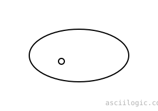
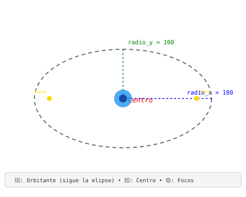

## Órbitas

Una [órbita](https://es.wikipedia.org/wiki/%C3%93rbita) es la trayectoria que sigue un objeto alrededor de otro debido a la gravedad. Por ejemplo, la Tierra sigue una órbita alrededor del Sol y la Luna alrededor de la Tierra.

Sin embargo, [calcular una órbita físicamente correcta,](https://es.wikipedia.org/wiki/Leyes_de_Kepler) requiere tener en cuenta variables como:

- la masa de los cuerpos.
- la posición y velocidad inicial.
- la fuerza gravitatoria.
- la aceleración.
- el paso de tiempo de la simulación.

En lugar de simular las fuerzas que producen la órbita, definimos directamente la trayectoria que queremos recorrer, esto resulta mucho más sencillo y, para muchos efectos de videojuegos, es muchas veces, suficiente. Aquí hemos optado por un método más directo: dibujar la trayectoria y mover el objeto sobre ella.

Este ejemplo es una aproximación muy sencilla, donde queremos controlar fácilmente la posición y velocidad de un objeto que orbita alrededor de otro.


## Elipses

Una [elipse](https://es.wikipedia.org/wiki/Elipse) es una curva cerrada parecida a un círculo alargado. Tiene dos puntos fijos llamados **focos**; la suma de las distancias desde cualquier punto de la elipse hasta ambos focos siempre es constante. Las órbitas de muchos planetas y satélites tienen forma de elipse.

La órbita de un cuerpo celeste puede ser **más circular** o **más alargada(elipse)**, esto se describe mediante la [excentricidad](https://es.wikipedia.org/wiki/Excentricidad_(matem%C3%A1tica)):

- **Excentricidad 0:** órbita perfectamente circular.
- **Excentricidad cercana a 0:** órbita casi circular.
- **Excentricidad cercana a 1:** órbita muy alargada, con forma de elipse estrecha.

Ejemplos:

- La órbita de **Venus** alrededor del Sol es casi circular.
- La órbita de la **Tierra** también es bastante circular, aunque es ligeramente elíptica.
- La órbita de **Mercurio** es más alargada que la de la Tierra.
- Algunos cometas, como el **cometa Halley**, tienen órbitas muy alargadas.

ahora, una órbita circular es un caso especial de una órbita elíptica. La forma depende principalmente de la velocidad y la dirección del cuerpo al moverse bajo la gravedad.

Una elipse puede representarse mediante dos radios:

```
radio_x: distancia máxima desde el centro en el eje X.
```

```
radio_y: distancia máxima desde el centro en el eje Y.
```

Por ejemplo:

```
radio_x = 300
radio_y = 200
```

produce una trayectoria más ancha que alta:



El punto ● representa el centro de la órbita.

Si **radio_x** y **radio_y** son iguales, la elipse se convierte en un círculo.


## Seno y Coseno

Para mover un objeto sobre una elipse, usamos el [Seno](https://es.wikipedia.org/wiki/Seno_(trigonometr%C3%ADa)) y el [Coseno](https://es.wikipedia.org/wiki/Coseno).

- **Seno (sin):** cuánto movernos hacia arriba o abajo (eje Y).
- **Coseno (cos):** cuánto movernos a la izquierda o derecha (eje X).

Al combinar ambos movimientos, con los radios de la elipse, el objeto comienza a girar. Si ambos radios son iguales, el objeto dibuja un círculo perfecto. Si son diferentes, dibuja una elipse.

Para recorrer una elipse podemos utilizar un ángulo `θ`, las coordenadas de un punto de la elipse se obtienen mediante:

```
x = centro_x + radio_x * cos(θ)
y = centro_y + radio_y * sin(θ)
```

Así que la idea es separar el movimiento en dos componentes:
```math
X → cos(θ)
```
que produce un desplazamiento horizontal

y
```math
Y → sin(θ)
```
que produce un desplazamiento vertical

Al combinar ambos movimientos obtenemos la elipse.



## referencias
- [órbita](https://es.wikipedia.org/wiki/%C3%93rbita)
- [elipse](https://es.wikipedia.org/wiki/Elipse)
- [excentricidad](https://es.wikipedia.org/wiki/Excentricidad_(matem%C3%A1tica))
- [asciilogic](https://asciilogic.com/)
- [markdown-svg-renderer](https://tools.simonwillison.net/markdown-svg-renderer)
- [SVG Animation](https://www.w3schools.com/graphics/svg_animation.asp)

