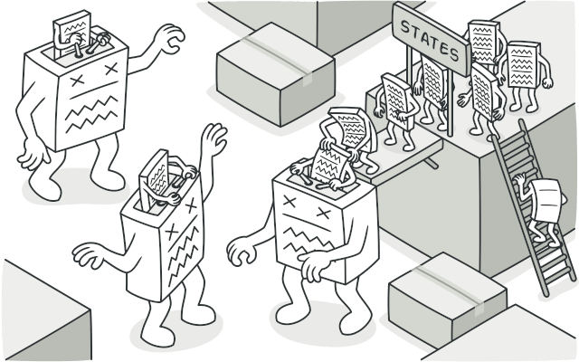
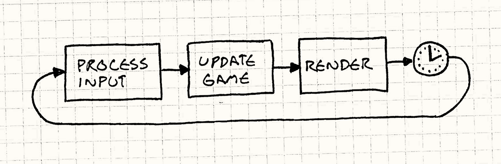

# Estados y Organización

## El (posible) problema

Cuando empiezas un juego, todo es muy simple:
- El juego en sí

Pero luego añades:
- Menú principal
- El juego en sí
- Pantalla de game over(juego terminado)

y luego...

- pantalla de bienvenida
- Intro
- Menú principal
- El juego en sí
- Pausa
- Pantalla de game over
- Pantalla de juego terminado
- Pantalla de creditos

...

Y nuestro código se convierte en un [nido](https://xkcd.com/1513/) de `if`/`else`


## Estados

Nuestro juego siempre está en **un solo estado** a la vez, como cambiar de canal en la tv.

### Estados típicos
- [pantalla de bienvenida](https://es.wikipedia.org/wiki/Pantalla_de_bienvenida)
- Menú principal
- Jugando: la acción principal
- Pausa: todo congelado
- Game Over: Fin de la partida

### Ejemplo de flujo
```
Menú -> (botón "Jugar") -> Jugando -> (pierdes) -> Game Over
  ↓ (Q)                         ↓ (Escape)
  Salir                       Pausa
```


## El Patrón State



Es una [forma de organizar el código](https://refactoring.guru/design-patterns/state) para que cada estado (menú, jugando, etc.) tenga su propia lógica [sin mezclarse con los demás](https://gameprogrammingpatterns.com/state.html).

- Cada estado es como un "modo" independiente
- El juego solo ejecuta el estado activo
- Cambiar de estado es reemplazar el modo activo por otro
- Código más limpio y ordenado
- Puedes trabajar en un estado sin romper otro
- Es fácil añadir nuevos estados después


## Gestor de Estados (State Manager)

Es quien decide qué estado está activo y maneja los cambios. Solo hace tres cosas (normalmente):
- Mantiene el estado actual
- Cambia a otro estado cuando se le pide
- Pasa el control al estado activo para que se actualice y dibuje


## Contexto

Son datos que todos los estados pueden usar.

### es necesario porque....
- El menú necesita mostrar la puntuación máxima (que se generó en Jugando)
- Game Over necesita saber cuántas vidas tenías
- Las opciones afectan a todos los estados

### qué debe ir
- **Progreso del jugador:** Nivel actual, puntuación, vidas
- **Configuración:** Volumen, dificultad, controles
- **Estadísticas:** Tiempo jugado, enemigos derrotados
- **Desbloqueos:** Logros, items especiales

### qué NO debe ir
- Posición de enemigos (es solo de Jugando)
- Animaciones específicas de un estado
- Datos temporales que solo usa un estado


## Bucles de juego (Game Loop)

Son el [ejemplo por excelencia de un "patrón de programación de videojuegos".](https://gameprogrammingpatterns.com/game-loop.html) Casi todos los videojuegos tienen uno, no hay dos que sean exactamente iguales y son relativamente pocos los programas fuera del ámbito de los videojuegos que los utilizan.
se resume un poco en desvincular el avance del tiempo del juego de las acciones del usuario y de la velocidad del procesador.

... y todo parte del ciclo principal del juego:


- **Entrada (Input)**: Procesa lo que hace el jugador (teclas, clics)
- **Actualización (update)**: Actualiza el estado activo (mueve personajes, calcula cosas)
- **Dibujar (draw/render)**: Dibuja todo en pantalla

El bucle del juego **no espera** a que el jugador haga algo, sigue ejecutandose aunque no hagas nada.

El bucle del juego es el que hace funcionar todo, y los estados son los que se ejecutan dentro de él, así que, si un estado tarda mucho en actualizarse, el juego se ralentiza. una solución podría ser, separar la actualización (que debe ser fija) del dibujado (que puede saltarse frames si es necesario).

### Cada estado debería tener (conceptualmente)
- Cómo se inicializan los datos del estado -> **new/constructor**
- Cómo se actualiza la lógica interna -> **update**
- Cómo se dibuja -> **draw**

```
MainMenu
├── new()
├── update(dt)
└── draw()

...

Playing
├── new()
├── update(dt)
└── draw()

...
```

## Un (muy) sencillo Ciclo de Vida de un Estado

### Entrar
- Preparar todo lo que necesita
- Mostrar pantalla inicial

### Actualizar
- Movimiento de personajes
- Detección de colisiones
- lógica interna del estado
- Verificar si hay que cambiar de estado

### Dibujar
- Pintar todo en pantalla

### Salir
- Guardar datos importantes
- Limpiar lo que ya no sirve


## Organización del Proyecto


no es construir una arquitectura perfecta. Es tener algo que funcione hoy y que pueda crecer mañana.

```
my_game\
├── README.md
└── src\
    ├── assets\
    │   ├── images\
    │   │   └── background.png
    │   │   └── player.png
    │   ├── levels\
    │   │   └── tilemap.png
    │   │   └── level_1.json
    │   └── sounds\
    │       └── pew_pew.ogg
    ├── game\
    │   └── main_menu.rs
    │   └── playing.rs
    │   └── game_over.rs
    └── main.rs
```

La [estructura exacta no importa](https://joshanthony.info/2021/12/06/how-i-structure-my-game-projects/) tanto, como mantener las responsabilidades claras.

## (algunas) Recomendaciones

- [Mantenerlo simple](https://es.wikipedia.org/wiki/Principio_KISS)
- Un estado **`==`** una responsabilidad clara
- Comienza con solo 3 estados: Menú, Jugando, Game Over
- Añade **Pausa** solo cuando la necesites
- Añade más estados gradualmente
- Los estados no se hablan entre sí (usan el gestor de estados)
- Cada estado hace **una cosa** y la hace bien
- Nombres claros: `MenuPrincipal`, `Jugando`, `Pausa`
- Guarda datos importantes(si es necesario) **antes** de cambiar de estado
- El contexto solo tiene lo que todos necesitan
- Resetea variables importantes al entrar a un estado
- No asumas que los datos de otro estado siguen disponibles
- Prueba cada estado por separado
- Añade más arquitectura cuando realmente la necesites.
- No estamos construyendo un motor AAA (no aún)


## Referencias

- [Game state (Macroquad)](https://mq.agical.se/ch8-game-state.html)
- [What is "game state? (stackexchange)"](https://gamedev.stackexchange.com/questions/4005/what-is-game-state)
- [Game States (reddit)](https://www.reddit.com/r/gamedev/comments/1b4wog/game_states_what_do_i_need_them_for_and_whats_the/)
- [Game Mode and Game State (epicgames)](https://dev.epicgames.com/documentation/unreal-engine/game-mode-and-game-state-in-unreal-engine)
- [Game States (ezengine)](https://ezengine.net/pages/docs/runtime/application/game-state.html)
- [Game Loop (Game Programming Patterns)](https://gameprogrammingpatterns.com/game-loop.html)
- [State (refactoring guru)](https://refactoring.guru/design-patterns/state)
- [Component (Game Programming Patterns)](https://gameprogrammingpatterns.com/component.html)
- [ASCII Tree Generator](https://asciitree.fr/en/tools/ascii-tree)
- [asciiflow](https://asciiflow.com/#/)
- [xkcd.com/927](https://xkcd.com/927/)
- [xkcd.com/1513](https://xkcd.com/1513/)
